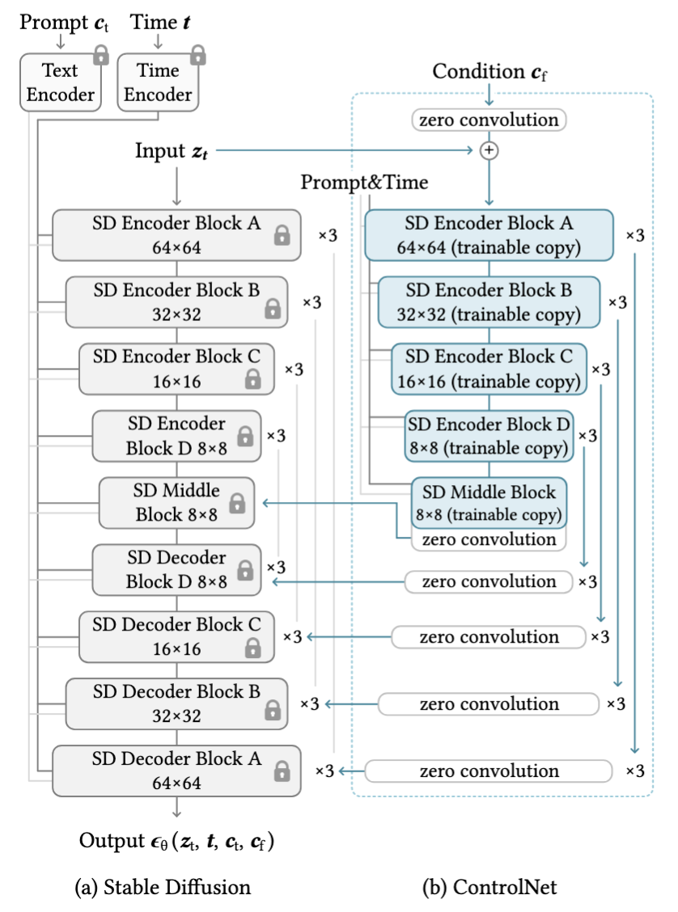

  <h1 align="center">Visualizing Conditioning Signal Influence in ControlNet: A Hybrid Approach</h1>
  

    <a href="mailto:zheng.junx@northeastern.edu">Junxin Zheng</a>¹, <a href="mailto:wang.zhen3@northeastern.edu">Zhen Wang</a>¹
  

  

    ¹<a href="https://khoury.northeastern.edu/">Northeastern University</a>
  

## Introduction: Balancing Control and Creativity in Image Generation

Recent advances in text-to-image diffusion models have enabled users exercise finegrained control over the generation process—not only through textual prompts, but also via spatial conditioning signals such as edges, poses, and segmentation maps. Among these techniques, ControlNet [1](#ref1) stands out as a powerful framework that integrates conditioning inputs directly into the architecture, applying them consistently throughout the entire generation process. 

While highly effective, its fixed conditioning strategy may impose unnecessary constraints in later denoising steps — potentially limiting creative diversity and increasing computational overhead. This observation motivates a key question:

> **How does conditioning signal affect the denoising process across timesteps?** 

Our research begins by examining the temporal dynamics of conditioning signals within ControlNet. We employ both visual and mathematical tools to understand their role during generation, with a particular focus on DT-Visualization, introduced by Gandikota and Bau [2](#ref2) that reveals the model’s internal predictions of the final image at any intermediate timestep. Through this lens, we uncover that most structural conditioning influence occurs in the early denoising steps. 

Based on this insight, we propose a novel approach-Hybrid-Control-Net, which dynamically transitions between model architectures during generation—using ControlNet for initial structural guidance in the early steps before switching to standard Stable Diffusion for creative refinement and efficiency.

To facilitate further exploration of these concepts, we've developed an open-source implementation available on our [GitHub repository](https://github.com/CS7150-Zheng-Wang/hybrid-control-net). Our codebase enables researchers and practitioners to experiment with different conditioning signals, transition points, and model combinations, providing a foundation for continued innovation in controlled image generation.

## Related Work

This project builds upon two primary foundations in the field of image generation with diffusion models. 

First, we leverage the **ControlNet** architecture proposed by Zhang et al. [[1]](#ref1) which introduces a trainable copy of the UNet encoder blocks that allows conditioning signals (such as edges, poses, or segmentation maps) to guide the image generation process. ControlNet has demonstrated remarkable ability to maintain fidelity to input conditions while preserving the high-quality generation capabilities of pretrained diffusion models.

<figure>
  

    
    <figcaption style="text-align: center; color: #000080; font-size: 0.8em;">
      <strong>Figure 0:</strong> The architecture of ControlNet, as proposed by Zhang et al. [1]. A parallel branch of UNet encoder blocks is added to process conditioning inputs. The outputs of this branch are merged with the original UNet via element-wise addition at corresponding resolutions, enabling spatial control without disrupting the pretrained weights.
    </figcaption>
  

</figure>

Our work is also heavily inspired by the recent advances in distillation techniques for diffusion models presented by Gandikota and Bau [[2]](#ref2). Their work introduces the concept of Diffusion Target (DT) visualization, which provides insights into what the model predicts as the final output at each intermediate denoising step. This visualization technique has proven invaluable for understanding how different models construct their outputs over time and has directly influenced our development of the hybrid-net approach described in this blog.

Our contribution builds on these foundations by analyzing how conditioning signals influence the denoising trajectory and proposing a novel switching mechanism between ControlNet and uncontrolled Stable Diffusion to optimize both conditioning fidelity and generation diversity/efficiency.

## Diffusion Target Visualization: Making Model Predictions Visible

Inspired by the groundbreaking work of Gandikota and Bau [[2]](#ref2), our approach leverages Diffusion Target Visualization (DT-Visualization) - a powerful technique that reveals the model's internal predictions at intermediate steps. DT-Visualization acts as a "time machine" into the generation process, allowing us to see what the model predicts as the final output long before the denoising process completes. For our implementation, we specifically utilized the EulerDiscreteScheduler [[3]](#ref3) to effectively extract and visualize these intermediate predictions.

<figure>
  

    
    <figcaption style="text-align: center; color: #000080; font-size: 0.8em;">
      <strong>Figure 1:</strong> The equation for Diffusion Target Visualization (DT-Visualization). It rearranges the diffusion equations to extract the model's prediction of the clean image (x̃₀,ₜ) at any timestep (t). This allows us to visualize how ControlNet interprets conditioning signals throughout the denoising trajectory.
    </figcaption>
  

</figure>

As shown in the equation above, DT-Visualization mathematically extracts the model's prediction of the clean image (x̃₀,ₜ) at any timestep (t) by rearranging the diffusion equations. This technique provides unique insights into how ControlNet interprets conditioning signals throughout the denoising trajectory, revealing that most of the structural conditioning information is captured in early timesteps - a key insight that enabled our hybrid approach. By visualizing these predictions at different stages, we can better understand how conditioning signals guide the generation process and identify the optimal point to transition between controlled and uncontrolled diffusion models.

## Visual Analysis of Denoising Processes

<figure>
  

    
    <figcaption style="text-align: center; color: #000080; font-size: 0.8em;">
      <strong>Figure 2:</strong> Comparison between standard denoising process (left) and Diffusion Target visualization (right) at different timesteps (0%, 30%, 60%, 100%) for three conditioning types: Canny edge, Open Pose, and Segmentation maps. DT-Visualization lets us see what the model predicts as the final output at each intermediate step. This helps us understand how ControlNets build their images over time.
    </figcaption>
  

</figure>

Figure 2 reveals fascinating insights into how conditioning signals influence the generation process. The left side shows traditional denoising process, where the image gradually emerges from random noise. The right side displays DT-Visualization results, showing how the model "sees" the target image at different timesteps.
Notably, DT-Visualization produces recognizable images much earlier in the process. For example, with canny edge detection (top row), we can see a clear image of "Girl with a Pearl Earring" at just 30% completion in the DT visualization, while the standard denoising still shows mostly noise. This suggests that the conditioning signal provides strong guidance early in the process.

## Hybrid-Control-Net Framework
The DT-Visualization technique revealed that conditioning information is predominantly captured in early timesteps, leading us to hypothesize that we could potentially boost both efficiency and output diversity by switching to stable diffusion at intermediate stages. Inspired by Gandikota and Bau's insights into diffusion model distillation [[2]](#ref2), we developed a novel hybrid approach that strategically transitions between models during the generation process.  

<figure>
  

    
    <figcaption style="text-align: center; color: #000080; font-size: 0.8em;">
      <strong>Figure 3:</strong> The hybrid-control-net architecture. It starts with a conditioning signal (like canny edge detection) and text prompt fed into ControlNet, which processes these inputs until a predetermined intermediate step. At this point, we switch to a standard Stable Diffusion model to complete the generation.
    </figcaption>
  

</figure>

As illustrated in Figure 3, our hybrid architecture begins with a conditioning signal (such as canny edge map) and text prompt fed into ControlNet, which processes these inputs until a predetermined intermediate step. At this critical juncture, instead of continuing with ControlNet for the entire denoising trajectory, we switch to a standard Stable Diffusion model to complete the generation. This transition allows us to leverage ControlNet's strong conditioning capabilities in early steps while benefiting from the broader creative capabilities of uncontrolled diffusion models in the refinement phase.

## Impact of Prompts on Generation Quality

<figure>
  

    
    <figcaption style="text-align: center; color: #000080; font-size: 0.8em;">
      <strong>Figure 4:</strong> Prompt dependency analysis across different conditioning methods. The left side shows generations with text prompts alongside conditioning signals, while the right shows generations with only conditioning signals. The top row uses canny edge detection, the middle row uses segmentation maps, and the bottom row uses pose information.
    </figcaption>
  

</figure>

Our experiments revealed a significant difference between ControlNet and regular Stable Diffusion models when it comes to prompt dependency. Figure 4 demonstrates how text prompts influence generation quality across different conditioning methods. A key finding was that ControlNet is specifically trained to optimize no-prompt generation with conditioning signals alone, while standard Stable Diffusion is not designed with this capability. 

The left side shows generations with text prompts alongside conditioning signals, while the right shows generations with only conditioning signals. With canny edge detection (top row), prompt-guided generations maintain remarkable consistency throughout all stages. When using ControlNet without prompts, the model still produces coherent variations that respect the conditioning signal. However, in the segmentation (middle row) and pose (bottom row) examples, the absence of prompts leads to more unpredictable outputs with standard Stable Diffusion, whereas ControlNet maintains better semantic coherence even without textual guidance. This difference in optimization targets further supports our hybrid approach, as it allows us to leverage the complementary strengths of both architectures.

## Conclusion: Reimagining ControlNet Through a Hybrid Lens

Our exploration of ControlNet's internal dynamics through DT-Visualization has led us to fundamentally reconsider how we approach controlled image generation. We're particularly excited about the potential of our hybrid approach, which represents more than just an efficiency optimization—it suggests a new paradigm for how we might leverage specialized and general models in complementary ways.

What fascinates us most is how this hybrid architecture seems to combine the best of both worlds: ControlNet's precision in early timesteps and Stable Diffusion's creative refinement in later stages. We've observed that conditioning signals provide their most critical guidance early in the process, raising an interesting question: are we over-conditioning our models by applying specialized architectures throughout the entire generation process? Our experiments suggest that the answer might be yes.

Looking ahead, we're curious whether we could develop automated methods to determine the optimal switching point dynamically, perhaps by analyzing the rate of change in DT-visualizations to detect when conditioning influence plateaus.

Additionally, we wonder if this approach might help address some of the diversity concerns noted in Gandikota and Bau's work [[2]](#ref2). By releasing the generation process from specialized control in later stages, we might recover some of the creative variability that can be lost in highly-conditioned models.

As we continue to develop this approach, we're eager to explore how it performs across different types of conditioning beyond the visual signals explored here. Could this hybrid architecture prove even more valuable for more abstract conditioning types? The journey of discovery continues, and we look forward to seeing how others might build upon these insights.

## References

<a id="ref1">[1]</a> Zhang, L., Rao, A., & Agrawala, M. (2023). Adding Conditional Control to Text-to-Image Diffusion Models. *arXiv preprint arXiv:2302.05543*. https://doi.org/10.48550/arXiv.2302.05543

<a id="ref2">[2]</a> Gandikota, R., & Bau, D. (2025). Distilling Diversity and Control in Diffusion Models. *arXiv preprint arXiv:2503.10637*. https://distillation.baulab.info/

<a id="ref3">[3]</a> Hugging Face. (2023). EulerDiscreteScheduler. Hugging Face Diffusers Documentation. https://huggingface.co/docs/diffusers/api/schedulers/euler